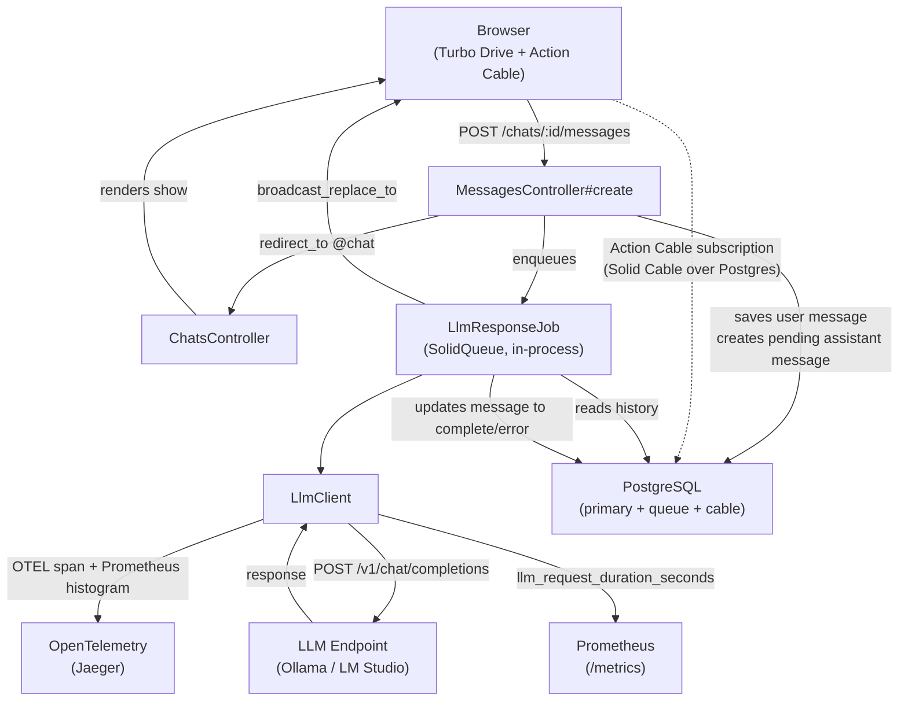
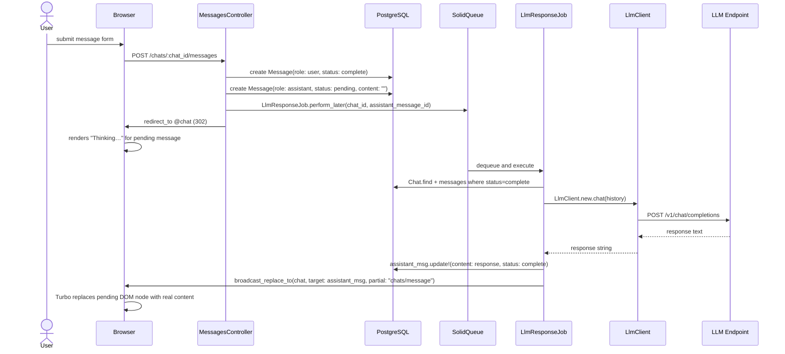
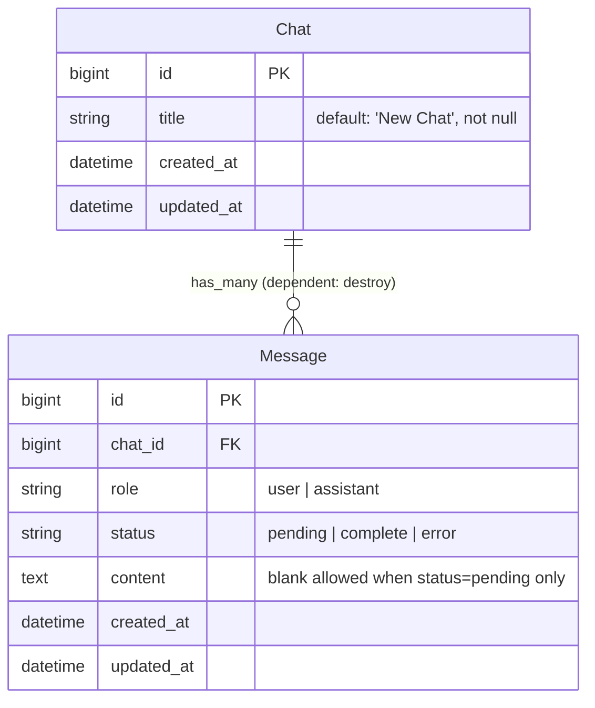

# Architecture

## Component Overview



---

## Request → Job → Broadcast Sequence



---

## Data Model



### Message status lifecycle

```
pending  ──► complete   (LlmResponseJob succeeds)
pending  ──► error      (LlmResponseJob rescues LlmClient::Error)
```

- Only `complete` messages are included in LLM history.
- The view renders "Thinking…" for `pending`; the Turbo broadcast swaps in real content.
- `content` presence is not validated when `status == "pending"`.
